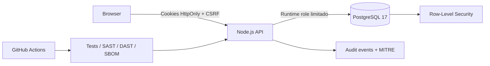

# Secure SaaS Lab

Laboratorio fullstack de AppSec que apresenta o mesmo SaaS financeiro multi-tenant em dois ambientes: `vulnerable` e `secure`. O objetivo e demonstrar exploracao, impacto, correcao, defesa em profundidade e evidencia automatizada no mesmo repositorio.

## O que este projeto prova

- Desenvolvimento fullstack com Node.js, PostgreSQL e JavaScript no navegador
- Autenticacao multifator e mensagens anti-enumeracao
- Access token curto em cookie `HttpOnly` e refresh token rotativo
- Protecao CSRF e deteccao de reutilizacao de refresh token
- Autorizacao por objeto e isolamento PostgreSQL Row-Level Security
- Auditoria por tenant com mapeamento MITRE ATT&CK
- Testes de regressao para BOLA, XSS, MFA, rate limiting e sessoes
- CI DevSecOps com SAST, DAST, CodeQL, secrets, dependencias, container e SBOM

## Comparacao dos ambientes

| Cenario | Vulnerable | Secure |
| --- | --- | --- |
| Login | Enumera usuarios e ignora MFA | Resposta uniforme, MFA e rate limiting |
| Sessao | Bearer token acessivel ao JavaScript | Cookie `HttpOnly`, access curto e refresh rotativo |
| Escrita | Sem protecao CSRF | Token CSRF vinculado a sessao |
| Faturas | BOLA/IDOR entre tenants | API ownership check + PostgreSQL RLS |
| Notas | Sink HTML deliberadamente inseguro | Texto contextualizado e limite server-side |
| Auditoria | Indisponivel | Role admin, filtro por tenant e MITRE ATT&CK |

## Inicio rapido

### Stack completa

Requer Docker Desktop.

```bash
TOKEN_SECRET="uma-chave-local-com-mais-de-32-caracteres" docker compose up -d --build
```

Acesse `http://127.0.0.1:3000`.

```bash
node scripts/verify-stack.mjs
docker compose down
```

### Demo sem banco

O fallback em memoria nao exige dependencias externas:

```bash
node src/server.js
```

## Credenciais de demonstracao

```text
E-mail: ana@acme.test
Senha:  Secure123!
MFA:    482911
Tenant: Acme Health
Role:   admin
```

Use `inv-2001` na consulta de fatura. A conta Acme recebe dados da Orbit no ambiente vulneravel. No ambiente seguro, recebe `404`; o evento e auditado como MITRE `T1190`.

## Arquitetura



A aplicacao usa um adapter de repositorio. Sem `DATABASE_URL`, trabalha em memoria; com a variavel configurada, usa PostgreSQL. O papel `aegis_app` nao possui privilegio de bypass de RLS. Funcoes `SECURITY DEFINER` pequenas e revogadas do `PUBLIC` cobrem apenas operacoes pre-auth e sessao.

## Testes

```bash
npm ci
npm run check
npm test
npm run verify:stack
```

A suite cobre:

- headers defensivos e CSP
- enumeracao de usuarios
- MFA e rate limiting
- cookies seguros sem exposicao do access token
- restauracao e rotacao de sessao
- deteccao de reutilizacao de refresh token
- CSRF
- BOLA vulneravel e bloqueada
- isolamento por tenant
- MITRE ATT&CK na auditoria

## Pipeline de seguranca

| Gate | Ferramenta |
| --- | --- |
| Unit/security tests | Node Test Runner |
| SAST | Semgrep OWASP + JavaScript |
| Semantic analysis | GitHub CodeQL |
| Secret scanning | Gitleaks |
| Dependency audit | npm audit |
| Container scan | Trivy |
| SBOM | Syft via Anchore SBOM Action |
| DAST | OWASP ZAP baseline |
| Stack integration | Docker Compose + RLS assertion |

O sink XSS intencional vive isolado em `src/public/vulnerable-lab.js` e esta documentado como risco aceito do laboratorio. O restante da aplicacao continua sujeito aos gates.

## Documentacao

- [Arquitetura](docs/ARCHITECTURE.md)
- [API](docs/API.md)
- [Threat model](docs/THREAT_MODEL.md)
- [Relatorio de seguranca](docs/SECURITY_REPORT.md)
- [Runbook](docs/RUNBOOK.md)
- [Roteiro de demonstracao](docs/DEMO_SCRIPT.md)
- [Estudo de caso para portfolio](docs/PORTFOLIO_CASE_STUDY.md)
- [Politica de seguranca](SECURITY.md)

## Estrutura

```text
db/migrations/              Schema, RLS, roles e seed
src/repositories/           Adapters memory e PostgreSQL
src/security.js             Tokens, cookies, hashing e rate limiting
src/server.js               HTTP API, sessoes e autorizacao
src/public/                 Interface responsiva
test/security.test.js       Testes de seguranca
scripts/verify-stack.mjs    Smoke test ponta a ponta
.github/workflows/          CI, CodeQL e DAST
docs/                       Evidencias e documentacao tecnica
```

## Limites conscientes

- Dados e credenciais sao ficticios.
- MFA usa codigo estatico para facilitar a demonstracao; producao usaria TOTP ou WebAuthn.
- O rate limiter em memoria deve ser substituido por Redis em multiplas instancias.
- O papel e a senha do banco em `compose.yaml` existem apenas para o ambiente local.
- O modo vulneravel deve permanecer isolado e nunca ser publicado com dados reais.
