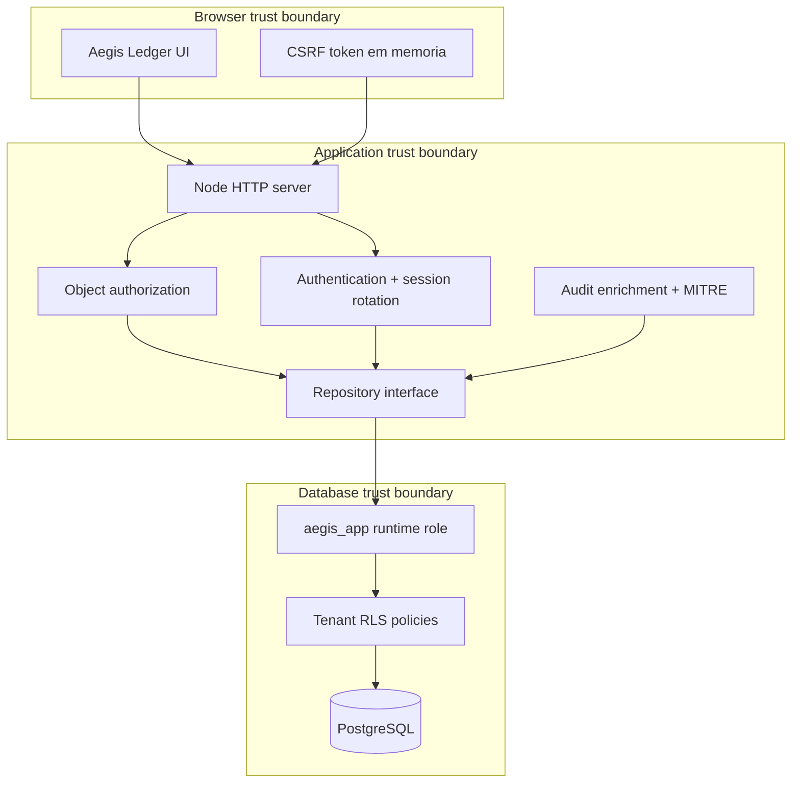

# Arquitetura

## Visao geral

O Secure SaaS Lab e uma aplicacao monolitica modular. A escolha reduz custo operacional para a demo sem misturar responsabilidades: HTTP, seguranca, persistencia e apresentacao possuem modulos separados.

## Fluxo de autenticacao segura

1. O cliente envia e-mail, senha e MFA.
2. A API responde de forma uniforme quando qualquer fator e invalido.
3. Um access token HMAC de cinco minutos e colocado em cookie `HttpOnly`.
4. Um refresh token opaco e armazenado apenas como SHA-256 no banco.
5. O token CSRF associado ao access token e devolvido ao JavaScript.
6. Escritas exigem cookie valido e `X-CSRF-Token` correspondente.
7. Refresh consome o token atual e cria outro na mesma familia.
8. Reutilizar um refresh token consumido revoga toda a familia.

## Autorizacao multi-tenant

A defesa possui duas camadas:

1. A API deriva `tenantId` do token assinado e valida ownership do objeto.
2. Cada transacao PostgreSQL define `app.tenant_id`; as policies RLS filtram leituras e escritas.

O cliente nunca escolhe seu tenant. Mesmo uma regressao na consulta da aplicacao encontra a barreira do banco.

## Persistencia

O contrato de repositorio possui adapters:

- `memory`: demo rapida e testes unitarios sem infraestrutura.
- `postgres`: persistencia, transacoes, RLS e sessoes duraveis.

O import de `pg` e dinamico, portanto o modo em memoria continua executavel sem instalar pacotes.

## Runtime containerizado

- Processo executado por usuario `aegis`, nao root.
- Filesystem read-only e `/tmp` pequeno com `noexec`.
- Todas as Linux capabilities removidas.
- `no-new-privileges` habilitado.
- Banco em rede interna sem porta publicada.
- Healthchecks em aplicacao e PostgreSQL.

## Decisoes de seguranca

- PBKDF2 foi escolhido por estar disponivel no runtime nativo; Argon2id seria preferivel em producao.
- Cookies `SameSite=Strict` reduzem superficie CSRF, mas o projeto tambem exige token explicito.
- Recursos nao autorizados retornam `404` para reduzir enumeracao.
- CSP nao permite `unsafe-inline`; ela funciona como defesa adicional ao output encoding.
- Eventos de login e acesso negado recebem tecnica e severidade para aproximar AppSec e detection engineering.
