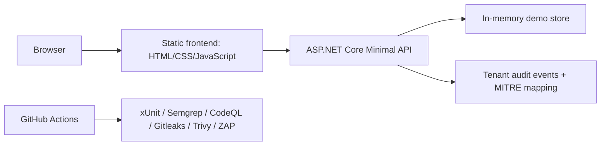

# Architecture

Secure SaaS Lab is an ASP.NET Core/.NET 10 portfolio application. The API serves both the security lab endpoints and the static frontend from `wwwroot`.

## Runtime

- `src/SecureSaasLab.Api/Program.cs` defines the API routes and defensive headers.
- `SecurityServices.cs` handles token signing, CSRF values, cookie serialization and input normalization.
- `Seed.cs` provides deterministic demo users, invoices and notes.
- `wwwroot` contains the browser UI. JavaScript here is expected because this is a fullstack web app.

## Security Controls

- Vulnerable login exposes enumeration behavior and skips MFA.
- Secure login uses generic errors, MFA and rate limiting.
- Secure sessions use short-lived access cookies, refresh-token rotation and CSRF checks.
- BOLA is demonstrated in vulnerable invoice lookup and blocked in secure invoice lookup.
- Audit events map denied resource access to MITRE ATT&CK-style evidence.
