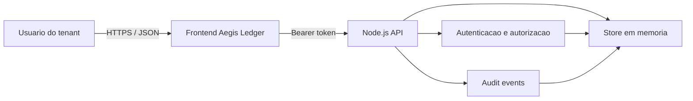

# Threat Model

## Escopo

O sistema representa um SaaS financeiro multi-tenant. Usuarios autenticados consultam faturas, publicam notas internas e, quando administradores, revisam eventos de auditoria.

## Ativos

- Credenciais e sessoes de usuarios
- Identidade, role e tenant do usuario
- Faturas e valores financeiros
- Notas internas
- Eventos de auditoria
- Segredo de assinatura dos tokens
- Refresh token families e CSRF tokens

## Fronteiras de confianca

1. Navegador para API: toda entrada e controlada pelo cliente.
2. Token para contexto de autorizacao: claims so sao aceitas apos verificacao da assinatura e expiracao.
3. Tenant para recurso: todo acesso a objeto precisa confirmar ownership no servidor.
4. Conteudo persistido para DOM: notas continuam nao confiaveis quando retornam do backend.

## Atores e objetivos

| Ator | Objetivo esperado | Risco associado |
| --- | --- | --- |
| Usuario legitimo | Operar dados do proprio tenant | Tentar acessar IDs de outro tenant |
| Atacante externo | Obter uma sessao | Enumerar contas e automatizar senhas |
| Usuario malicioso | Compartilhar conteudo | Injetar HTML/JavaScript nas notas |
| Administrador | Investigar eventos | Expor logs de outro tenant |

## STRIDE resumido

| Categoria | Ameaca | Controle seguro |
| --- | --- | --- |
| Spoofing | Credential stuffing | MFA, resposta generica e rate limiting |
| Spoofing | Roubo/replay de refresh token | Hash no banco, rotacao e revogacao da familia |
| Tampering | Token alterado | HMAC e `timingSafeEqual` |
| Repudiation | Negar consulta indevida | Eventos de auditoria com ator e recurso |
| Information Disclosure | BOLA em faturas | Ownership por tenant e resposta 404 |
| Denial of Service | Corpo ou login ilimitado | Limite de body e janela de tentativas |
| Elevation of Privilege | Analista consultar auditoria | Checagem server-side de role `admin` |

## Requisitos de seguranca

- A API nunca confia em `tenantId` enviado pelo cliente.
- Recursos de outro tenant nao revelam sua existencia.
- Erros de login nao distinguem usuario inexistente de senha ou MFA incorretos.
- Conteudo de notas e tratado como texto no ambiente seguro.
- A auditoria e filtrada pelo tenant autenticado e exige role administrativa.
- Tokens expirados, alterados ou com claims inconsistentes sao rejeitados.
- Escritas seguras exigem CSRF associado ao access token.
- O runtime PostgreSQL nao possui privilegio de bypass de RLS.

## Riscos residuais

- A demo Docker recebe o segredo por variavel; producao ainda exige secret manager.
- O store em memoria e somente um fallback e nao oferece durabilidade.
- Rate limiting em memoria nao funciona entre multiplas instancias.
- MFA estatico nao representa TOTP, WebAuthn ou recovery codes reais.
